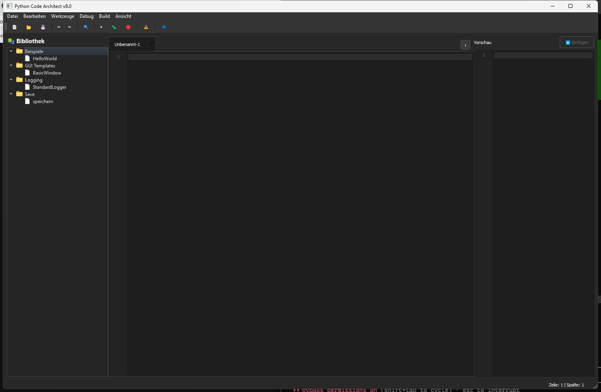

# Python Code Architect (PythonBox) v8

PythonBox ist eine leichtgewichtige Python-IDE mit Dark Theme, integriertem Debugging, Code Folding und optionaler Editor-Integration für VS Code und PyCharm.

PythonBox is a lightweight Python IDE with a dark theme, integrated debugging, code folding, and optional VS Code/PyCharm integration.


## Funktionen / Features

### Editor
- Python-Syntax-Highlighting
- Auto-Completion für Keywords, Builtins und Snippets
- Code Folding für Klassen und Funktionen
- Minimap und Bracket Matching
- Mehrere Dateien über Tabs

### Debugging und Entwicklung
- Ausführen über `sys.executable`
- PDB-Debugger im Output-Panel
- Breakpoints über die Zeilennummern
- Debug-Toolbar mit Step In, Step Over und Step Out
- Linter-Integration für Pylint und Flake8
- Git-Status, Diff und Modified-Markierung

### Windows-Paketierung
- `PythonBox.ico` wird als App- und Fenstericon verwendet, wenn die Datei vorhanden ist.
- `build_exe.bat` erstellt eine kompakte Windows-EXE mit PyInstaller.
- `START_PythonBox_v8.bat` startet die Anwendung direkt aus dem Checkout.

## Screenshot



## Installation

### Voraussetzungen / Requirements
- Python 3.8+
- PySide6 6.5+
- Optional: Git, Pylint, Flake8, VS Code, PyCharm

### Start aus dem Quellcode / Run from source

```bash
git clone https://github.com/dev-bricks/pythonbox.git
cd pythonbox
pip install -r requirements.txt
python PythonBox_v8.py
```

Unter Windows kann alternativ `START_PythonBox_v8.bat` per Doppelklick gestartet werden.

### Windows-EXE bauen / Build Windows EXE

```bash
pip install pyinstaller
build_exe.bat
```

Das Build-Ergebnis liegt anschließend in `dist/`. Build-Artefakte und lokale Releases sind bewusst nicht Teil des Git-Repositories.

## Tastenkürzel / Keyboard Shortcuts

| Shortcut | Funktion / Action |
|---|---|
| `Ctrl+F` | Suchen / Find |
| `Ctrl+H` | Ersetzen / Replace |
| `Ctrl+G` | Gehe zu Zeile / Go to line |
| `Ctrl+/` | Kommentieren / Toggle comment |
| `F5` | Ausführen / Run |
| `F9` | Breakpoint umschalten / Toggle breakpoint |
| `F10` | Step Over |
| `F11` | Step Into |

## Datenschutz / Privacy

PythonBox arbeitet lokal. Es gibt keine Telemetrie, keinen Cloud-Sync und keine eingebauten externen API-Aufrufe. Dateien werden nur geöffnet, gespeichert oder ausgeführt, wenn Nutzerinnen und Nutzer diese Aktionen in der App auslösen.

PythonBox runs locally. It does not include telemetry, cloud sync, or built-in external API calls. Files are opened, saved, or executed only when users trigger those actions in the app.

## Repository-Hygiene

Nicht versioniert werden interne Aufgabenlisten, Test-Locks, lokale Build-Artefakte, Release-Ordner, virtuelle Umgebungen, Datenbanken, Secrets und IDE-/OS-Metadaten. Details stehen in `.gitignore`.

## Roadmap

PythonBox bleibt als schlanke Python-IDE erhalten. Die geplante Multi-Language-Erweiterung läuft separat unter CodeBox.

## Lizenz / License

MIT License, siehe [LICENSE](LICENSE).

## Haftung / Liability

Dieses Projekt wird unentgeltlich als Open Source bereitgestellt. Nutzung auf eigenes Risiko. Es gibt keine Wartungszusage, keine Verfügbarkeitsgarantie und keine Gewähr für Fehlerfreiheit oder Eignung für einen bestimmten Zweck. Ergänzend gilt der Haftungsausschluss der MIT-Lizenz.

This project is provided as free open source software. Use it at your own risk. There is no maintenance commitment, availability guarantee, or warranty of fitness for a particular purpose. The MIT license disclaimer also applies.
