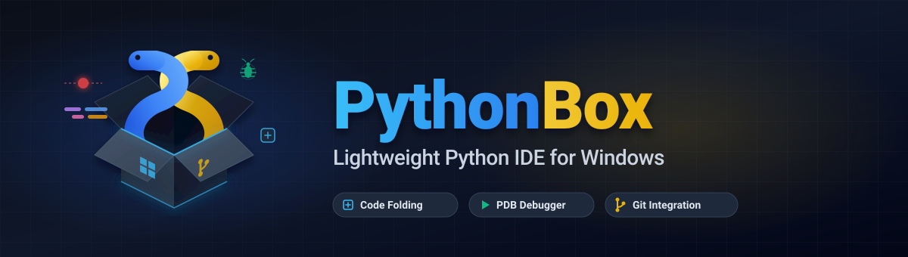
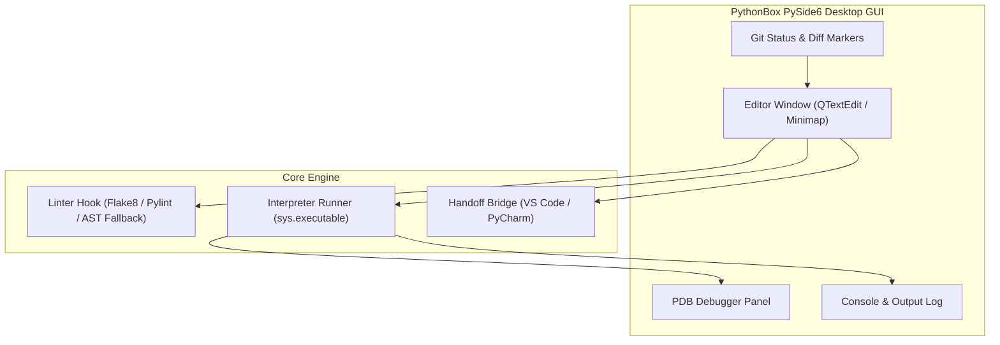
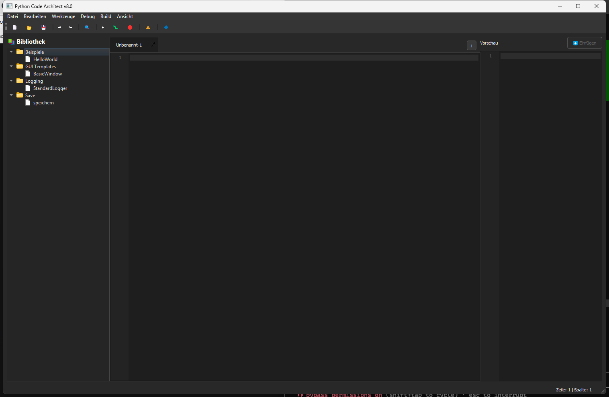

# PythonBox — Lightweight Python IDE for Windows

[English](README.md) | [Deutsch](README_de.md)

> Focused editor with PDB debugging, code folding, linting, Git status, and VS Code/PyCharm handoff.

[](https://www.python.org/)
[](https://pypi.org/project/PySide6/)
[](https://github.com/dev-bricks/pythonbox/actions/workflows/tests.yml)
[](tests/)
[](llms.txt)
[](https://github.com/dev-bricks)
[](https://github.com/open-bricks)
[](LICENSE)

PythonBox is a local-first Python IDE for Windows developers who want a focused editor with PySide6, PDB debugging, code folding, linting, Git status, and optional handoff to VS Code or PyCharm.

> [!NOTE]
> **Local-First & Zero Telemetry**: PythonBox is engineered to run 100% offline with zero cloud sync, zero telemetry, and local file storage. It is fully indexable and optimized for LLM-assisted workflows via `llms.txt`.

> [!TIP]
> **PDB Debugging & Headless Mode**: Toggle breakpoints directly in the GUI editor or launch PythonBox headlessly in CI/automation pipelines using `--run demo.py` or `--lint demo.py`.

## Start here

| If you want to... | Start with |
|---|---|
| Try the IDE from source | `python PythonBox_v8.py` |
| Build a local Windows EXE | `build_exe.bat` |
| Check the regression suite | `python -m pytest` |
| Understand the platform boundary | [PORTIERUNGSPLAN.md](PORTIERUNGSPLAN.md) |
| Give an LLM or crawler the repo context | [llms.txt](llms.txt) |

## Why PythonBox?

PythonBox is built for small Python scripts, local automation tools, learning workflows, and LLM-assisted coding sessions where a full IDE can feel too heavy. It keeps the core loop in one desktop window: open a file, edit Python, run it with the current interpreter, inspect output, debug with breakpoints, and check Git changes before handing the file to a larger IDE when needed.

## System Architecture


```mermaid
flowchart TD
    subgraph GUI ["PythonBox PySide6 Desktop GUI"]
        ED["Editor Window (QTextEdit / Minimap)"]
        DBG["PDB Debugger Panel"]
        OUT["Console & Output Log"]
        GIT_PANEL["Git Status & Diff Markers"]
    end

    subgraph CORE ["Core Engine"]
        LINT["Linter Hook (Flake8 / Pylint / AST Fallback)"]
        EXEC["Interpreter Runner (sys.executable)"]
        HANDOFF["Handoff Bridge (VS Code / PyCharm)"]
    end

    ED --> EXEC
    ED --> LINT
    EXEC --> OUT
    EXEC --> DBG
    ED --> HANDOFF
    GIT_PANEL --> ED
```

## Screenshot




## Features

### Editor
- Python syntax highlighting
- Auto-completion for keywords, builtins, and snippets
- Code folding for classes and functions
- Minimap and bracket matching
- Multi-file tabbed editing

### Debugging and Development
- Execution via current Python interpreter (`sys.executable`)
- PDB debugger inside the output panel
- Line number breakpoint toggling
- Debug toolbar with Step In, Step Over, and Step Out
- Linter integration for Pylint and Flake8 (with AST fallback)
- Git status, diff, and line-level modification markers
- Combined Git status codes formatted readably; replaced diff lines marked as modified
- Qt6-compatible editor metrics and F5 run via debug output panel
- `Save As` preserves original path when dialog is cancelled
- Minimap toggle synchronized between View menu and Settings dialog
- Snippet library and portable editor settings import/export via JSON (`pythonbox-snippets-v1.json`, `pythonbox-settings-v1.json`)

### Windows Packaging
- `PythonBox.ico` used as app and window icon when present
- `build_exe.bat` builds a compact Windows executable via PyInstaller
- `START_PythonBox_v8.bat` launches the app directly from checkout

### Platform Strategy
- Windows remains the primary desktop platform
- macOS and Linux serve as source-smoke targets from the same PySide6 codebase
- Android, iOS, and Web/PWA are explicitly out of scope because PythonBox relies on local files, local interpreters, PDB, linters, and Git

## Installation

### Requirements
- Python 3.10+
- PySide6 6.5+
- Optional: Git, Pylint, Flake8, VS Code, PyCharm

### Run from source

```bash
git clone https://github.com/dev-bricks/pythonbox.git
cd pythonbox
pip install -r requirements.txt
python PythonBox_v8.py
```

On Windows, `START_PythonBox_v8.bat` can be launched via double click.

Optionally open a file or set a theme on startup:

```bash
python PythonBox_v8.py --open demo.py
python PythonBox_v8.py demo.py
python PythonBox_v8.py --theme dracula --open demo.py
```

Headless modes for local automation and linter pipelines:

```bash
python PythonBox_v8.py --run demo.py
python PythonBox_v8.py --lint demo.py
```

### Build Windows EXE

```bash
pip install pyinstaller
build_exe.bat
```

The resulting build is placed in `dist/`. Build artifacts and local releases are intentionally excluded from the Git repository.

## Tests

The test suite includes 92 unit and regression tests (Pytest & Unittest). It verifies Qt6 API compatibility, F5 execution routing, PDB debugger interaction, linter fallbacks, Git diff/status handling, JSON import/export, headless CLI flags (`--run`, `--lint`), and offscreen main window construction.

```bash
python -m pytest
```

GitHub Actions executes these checks on Windows for Python 3.10 through 3.12.

## Keyboard Shortcuts

| Shortcut | Action |
|---|---|
| `Ctrl+F` | Find |
| `Ctrl+H` | Replace |
| `Ctrl+G` | Go to line |
| `Ctrl+/` | Toggle comment |
| `F5` | Run |
| `F9` | Toggle breakpoint |
| `F10` | Step Over |
| `F11` | Step Into |

## Privacy

PythonBox operates 100% locally. It contains no telemetry, no cloud sync, and no built-in external API calls. Files are opened, saved, or executed only when explicitly triggered by user action.

## Repository Hygiene

Internal task lists, test locks, local build artifacts, release folders, virtual environments, databases, secrets, and IDE/OS metadata are untracked. Details are specified in `.gitignore`.

## Roadmap

PythonBox remains a lightweight Python IDE. Multi-language support is developed separately under CodeBox.

## Discovery keywords

`python ide`, `lightweight python editor`, `pyside6 code editor`, `windows python ide`, `local-first developer tool`, `pdb debugger gui`, `python linting`, `code folding`, `git diff editor`, `vs code handoff`, `pycharm handoff`, `offline python editor`

## License

MIT License, see [LICENSE](LICENSE).

## Liability

This project is provided as free open source software. Use it at your own risk. There is no maintenance commitment, availability guarantee, or warranty of fitness for a particular purpose. The MIT license disclaimer applies.
