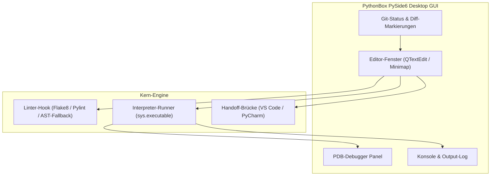

# PythonBox — Schlanke Python-IDE für Windows

[English](README.md) | [Deutsch](README_de.md)

> Fokussierter Editor mit PDB-Debugging, Code Folding, Linting, Git-Status und Übergabe an VS Code/PyCharm.

[](https://www.python.org/)
[](https://pypi.org/project/PySide6/)
[](https://github.com/dev-bricks/pythonbox/actions/workflows/tests.yml)
[](tests/)
[](llms.txt)
[](https://github.com/dev-bricks)
[](https://github.com/open-bricks)
[](LICENSE)

PythonBox ist eine lokale Python-IDE für Windows-Entwicklerinnen und -Entwickler, die einen fokussierten Editor mit PySide6, PDB-Debugging, Code Folding, Linting, Git-Status und optionaler Übergabe an VS Code oder PyCharm suchen.

> [!NOTE]
> **Local-First & Zero-Telemetry**: PythonBox läuft 100% lokal ohne Cloud-Zwang, ohne Telemetrie und speichert Daten ausschließlich auf dem lokalen Dateisystem. Das Repository ist für KI-Agenten und LLM-Workflows über `llms.txt` optimiert.

> [!TIP]
> **PDB-Debugging & Headless-Modus**: Breakpoints lassen sich direkt im GUI-Editor setzen oder in CI/Automatisierungs-Pipelines headless über `--run demo.py` bzw. `--lint demo.py` ausführen.

## Schnellstart

| Ziel | Startbefehl / Datei |
|---|---|
| IDE aus dem Quellcode starten | `python PythonBox_v8.py` |
| Lokale Windows-EXE bauen | `build_exe.bat` |
| Regressionstests ausführen | `python -m pytest` |
| Plattformstrategie verstehen | [PORTIERUNGSPLAN.md](PORTIERUNGSPLAN.md) |
| Kontext für KI-Agenten & Crawler | [llms.txt](llms.txt) |

## Warum PythonBox?

PythonBox wurde für kleine Python-Skripte, lokale Automatisierungstools, Lern-Workflows und KI-unterstützte Coding-Sessions entwickelt, bei denen eine vollständige IDE zu schwerfällig wirkt. Es hält den Kern-Workflow in einem einzigen Desktop-Fenster: Datei öffnen, Python editieren, mit dem aktuellen Interpreter ausführen, Ausgaben prüfen, mit Breakpoints debuggen und Git-Änderungen einsehen, bevor die Datei bei Bedarf an eine größere IDE übergeben wird.

## Systemarchitektur



## Screenshot


## Funktionen / Features

### Editor
- Python-Syntax-Highlighting
- Auto-Completion für Keywords, Builtins und Snippets
- Code Folding für Klassen und Funktionen
- Minimap und Bracket Matching
- Mehrere Dateien über Tabs

### Debugging und Entwicklung
- Ausführen über `sys.executable`
- PDB-Debugger im Output-Panel
- Breakpoints über die Zeilennummern
- Debug-Toolbar mit Step In, Step Over und Step Out
- Linter-Integration für Pylint und Flake8 (mit AST-Fallback)
- Git-Status, Diff und Modified-Markierung
- Kombinierte Git-Statuscodes werden lesbar angezeigt; ersetzte Diff-Zeilen werden als geändert statt nur als hinzugefügt markiert
- Qt6-kompatible Editor-Metriken und F5-Ausführung über das Debug-Output-Panel
- `Speichern unter` behält bei abgebrochenem Dialog den bisherigen Dateipfad
- Die Minimap-Einstellung bleibt zwischen Ansicht-Menü und Einstellungsdialog synchron, inklusive Fallback für ältere Konfigurationen
- Snippet-Bibliothek und portable Editor-Einstellungen lassen sich optional als JSON importieren und exportieren (`pythonbox-snippets-v1.json`, `pythonbox-settings-v1.json`)

### Windows-Paketierung
- `PythonBox.ico` wird als App- und Fenstericon verwendet.
- `build_exe.bat` erstellt eine kompakte Windows-EXE mit PyInstaller.
- `START_PythonBox_v8.bat` startet die Anwendung direkt aus dem Checkout.

### Plattformstrategie
- Windows bleibt die primäre Desktop-Plattform.
- macOS und Linux sind sinnvolle Source-Smoke-Ziele aus derselben PySide6-Codebasis.
- Android, iOS und Web/PWA sind keine aktuellen Ziele, weil PythonBox lokale Dateien, lokale Interpreter, Debugger, Linter und Git direkt nutzt.

## Installation

### Voraussetzungen / Requirements
- Python 3.10+
- PySide6 6.5+
- Optional: Git, Pylint, Flake8, VS Code, PyCharm

### Start aus dem Quellcode / Run from source

```bash
git clone https://github.com/dev-bricks/pythonbox.git
cd pythonbox
pip install -r requirements.txt
python PythonBox_v8.py
```

Unter Windows kann alternativ `START_PythonBox_v8.bat` per Doppelklick gestartet werden.

Optional kann direkt beim Start eine Datei geöffnet oder ein Theme vorgegeben werden:

```bash
python PythonBox_v8.py --open demo.py
python PythonBox_v8.py demo.py
python PythonBox_v8.py --theme dracula --open demo.py
```

Headless-Modi für lokale Automationen und Linter-Pipelines:

```bash
python PythonBox_v8.py --run demo.py
python PythonBox_v8.py --lint demo.py
```

### Windows-EXE bauen / Build Windows EXE

```bash
pip install pyinstaller
build_exe.bat
```

Das Build-Ergebnis liegt anschließend in `dist/`. Build-Artefakte und lokale Releases sind bewusst nicht Teil des Git-Repositories.

## Tests

Die Testsuite umfasst 92 Unit- und Regressionstests (Pytest & Unittest). Sie prüft die Qt6-API-Kompatibilität, F5-Ausführung, PDB-Debugger-Routen, Linter-Parsing, Git-Status-/Diff-Erkennung, JSON-Import/Export, CLI-Headless-Flags (`--run`, `--lint`) und Offscreen-Window-Herstellung.

```bash
python -m pytest
```

GitHub Actions führt diese Prüfungen unter Windows für Python 3.10 bis 3.12 aus.

## Tastenkürzel / Keyboard Shortcuts

| Shortcut | Funktion / Action |
|---|---|
| `Ctrl+F` | Suchen / Find |
| `Ctrl+H` | Ersetzen / Replace |
| `Ctrl+G` | Gehe zu Zeile / Go to line |
| `Ctrl+/` | Kommentieren / Toggle comment |
| `F5` | Ausführen / Run |
| `F9` | Breakpoint umschalten / Toggle breakpoint |
| `F10` | Step Over |
| `F11` | Step Into |

## Datenschutz / Privacy

PythonBox arbeitet lokal. Es gibt keine Telemetrie, keinen Cloud-Sync und keine eingebauten externen API-Aufrufe. Dateien werden nur geöffnet, gespeichert oder ausgeführt, wenn Nutzerinnen und Nutzer diese Aktionen in der App auslösen.

## Repository-Hygiene

Nicht versioniert werden interne Aufgabenlisten, Test-Locks, lokale Build-Artefakte, Release-Ordner, virtuelle Umgebungen, Datenbanken, Secrets und IDE-/OS-Metadaten. Details stehen in `.gitignore`.

## Roadmap

PythonBox bleibt als schlanke Python-IDE erhalten. Die geplante Multi-Language-Erweiterung läuft separat unter CodeBox.

## Suchbegriffe / Discovery keywords

`python ide`, `lightweight python editor`, `pyside6 code editor`, `windows python ide`, `local-first developer tool`, `pdb debugger gui`, `python linting`, `code folding`, `git diff editor`, `vs code handoff`, `pycharm handoff`, `offline python editor`

## Lizenz / License

MIT License, siehe [LICENSE](LICENSE).

## Haftung / Liability

Dieses Projekt wird unentgeltlich als Open Source bereitgestellt. Nutzung auf eigenes Risiko. Es gibt keine Wartungszusage, keine Verfügbarkeitsgarantie und keine Gewähr für Fehlerfreiheit oder Eignung für einen bestimmten Zweck. Ergänzend gilt der Haftungsausschluss der MIT-Lizenz.
